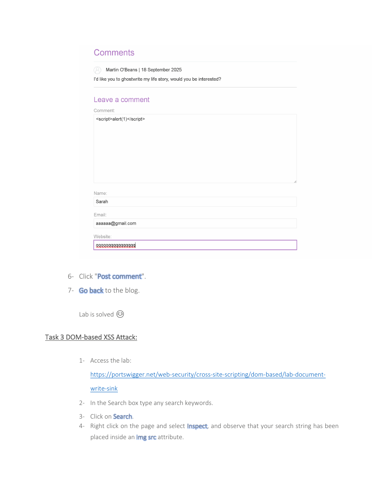
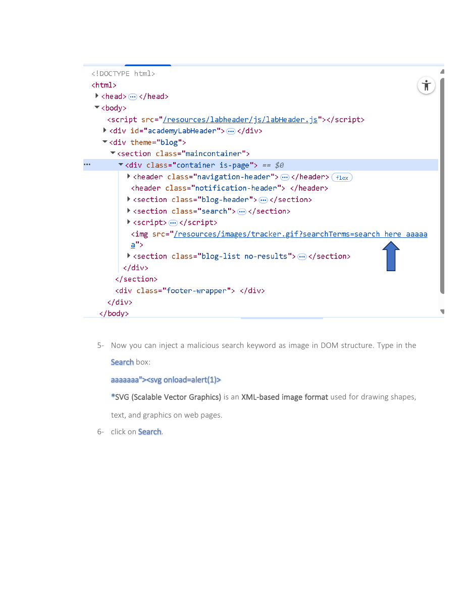

# DOM XSS in a document.write Sink


## Overview

An authorized DOM-based XSS exercise in which search input is processed by client-side JavaScript and inserted into an image attribute through document.write.

## Objective

Inspect the DOM sink, understand the HTML attribute context, and demonstrate safe client-side code execution with the supplied SVG-based proof of concept.

## Ethical Scope

This repository documents an exercise completed in an authorized training environment. It must not be used against systems, accounts, or people without explicit permission. All credentials, targets, and payloads referenced here are limited to disposable lab resources.

## Skills Demonstrated

- DOM inspection
- Client-side data-flow analysis
- HTML attribute breakout
- DOM XSS validation

## Tools Used

- PortSwigger Web Security Academy
- Browser Developer Tools
- Burp Suite
- Kali Linux

## Lab Environment

PortSwigger training lab: DOM XSS in document.write using source location.search inside a select element / image-related context as shown in the material.

## Step-by-Step Walkthrough

1. Open the assigned DOM XSS lab.
2. Submit a normal search value and inspect the resulting DOM.
3. Observe where the search string is inserted into the generated markup.
4. Submit the provided SVG payload designed for the identified context.
5. Confirm that the browser executes the harmless alert.

## Commands and Test Inputs

```text
aaaaaaa"><svg onload=alert(1)>
```

## Security Concepts

- DOM XSS is caused by unsafe client-side handling rather than server-side reflection alone.
- Sources provide attacker-controlled data; sinks interpret that data as markup or code.

## Defensive Recommendations

- Use secure coding controls appropriate to the demonstrated weakness.
- Apply least privilege and strong server-side authorization.
- Log and alert on suspicious input, authentication, and data-change patterns.
- Keep testing isolated and limited to explicitly authorized targets.

## MITRE ATT&CK Mapping

MITRE ATT&CK Enterprise: T1059.007 - JavaScript (conceptual mapping only).

## Lessons Learned

- Developer Tools are essential for understanding how user input reaches a DOM sink.
- Payload construction must match the exact HTML and JavaScript context.

## Evidence




## Source Material

- `XSS ATTACK KAUST PORTSWIGGER.pdf`
- Relevant source pages: 3, 4

## Disclaimer

This project is provided for education, defensive learning, and portfolio documentation. It does not authorize testing of third-party systems.
