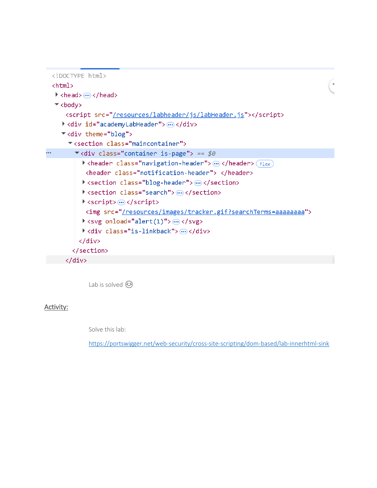

# DOM XSS in an innerHTML Sink


## Overview

A follow-up PortSwigger activity focused on identifying and exploiting a DOM XSS condition where untrusted input reaches an innerHTML sink.

## Objective

Solve the assigned innerHTML-sink lab by tracing attacker-controlled input to the unsafe DOM operation and validating execution in the authorized environment.

## Ethical Scope

This repository documents an exercise completed in an authorized training environment. It must not be used against systems, accounts, or people without explicit permission. All credentials, targets, and payloads referenced here are limited to disposable lab resources.

> **Source limitation:** The source provides the activity link but does not show the completed steps or final payload.

## Skills Demonstrated

- DOM source-and-sink analysis
- innerHTML risk assessment
- Payload adaptation
- Independent lab solving

## Tools Used

- PortSwigger Web Security Academy
- Browser Developer Tools
- Burp Suite
- Kali Linux

## Lab Environment

PortSwigger training activity: DOM XSS in innerHTML sink using source location.search.

## Step-by-Step Walkthrough

1. Open the activity link provided in the material.
2. Identify how the page reads the search value.
3. Inspect the client-side code and locate the innerHTML sink.
4. Construct a harmless proof of concept suitable for the sink.
5. Confirm execution and document the result.

## Commands and Test Inputs

```text
Payload was not explicitly included in the source material.
```

## Security Concepts

- innerHTML parses strings as HTML and is unsafe for untrusted data unless properly sanitized.
- Safer alternatives include textContent when HTML rendering is not required.

## Defensive Recommendations

- Use secure coding controls appropriate to the demonstrated weakness.
- Apply least privilege and strong server-side authorization.
- Log and alert on suspicious input, authentication, and data-change patterns.
- Keep testing isolated and limited to explicitly authorized targets.

## MITRE ATT&CK Mapping

MITRE ATT&CK Enterprise: T1059.007 - JavaScript (conceptual mapping only).

## Lessons Learned

- The source material assigns this as an independent activity, so the exact submitted payload should be documented from the learner’s own evidence.

## Evidence



## Source Material

- `XSS ATTACK KAUST PORTSWIGGER.pdf`
- Relevant source pages: 5

## Disclaimer

This project is provided for education, defensive learning, and portfolio documentation. It does not authorize testing of third-party systems.
