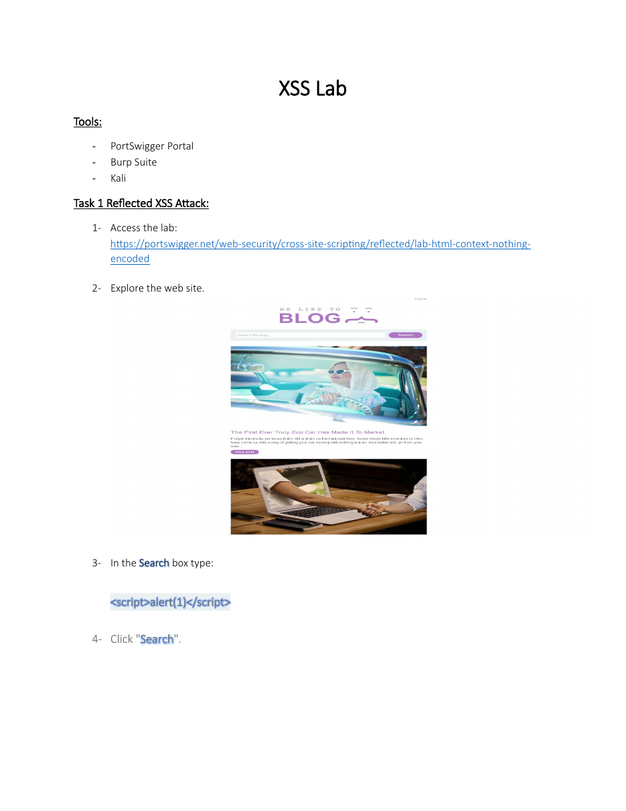

# Reflected XSS in an HTML Context


## Overview

An authorized PortSwigger Web Security Academy exercise demonstrating how unsanitized search input can be reflected into an HTML response and executed by the browser.

## Objective

Confirm a reflected cross-site scripting weakness by supplying a harmless JavaScript proof of concept and observing client-side execution.

## Ethical Scope

This repository documents an exercise completed in an authorized training environment. It must not be used against systems, accounts, or people without explicit permission. All credentials, targets, and payloads referenced here are limited to disposable lab resources.

## Skills Demonstrated

- Reflected XSS identification
- Input/output tracing
- Browser-based validation
- Safe proof-of-concept testing

## Tools Used

- PortSwigger Web Security Academy
- Burp Suite
- Kali Linux
- Web browser

## Lab Environment

PortSwigger training lab: Reflected XSS into an HTML context with nothing encoded.

## Step-by-Step Walkthrough

1. Open the assigned PortSwigger lab.
2. Explore the application and locate the search function.
3. Submit the provided harmless alert payload in the search field.
4. Observe that the payload is reflected into the response and executed.
5. Record the result and mark the lab as solved.

## Commands and Test Inputs

```text
<script>alert(1)</script>
```

## Security Concepts

- Reflected XSS occurs when request data is immediately returned in an unsafe response context.
- Output encoding and contextual escaping prevent the browser from interpreting data as executable code.

## Defensive Recommendations

- Use secure coding controls appropriate to the demonstrated weakness.
- Apply least privilege and strong server-side authorization.
- Log and alert on suspicious input, authentication, and data-change patterns.
- Keep testing isolated and limited to explicitly authorized targets.

## MITRE ATT&CK Mapping

MITRE ATT&CK Enterprise: T1059.007 - JavaScript (conceptual mapping only; the activity occurred in a training web application).

## Lessons Learned

- Always identify the injection context before selecting a test payload.
- A simple alert is sufficient to prove execution without causing harm.

## Evidence



## Source Material

- `XSS ATTACK KAUST PORTSWIGGER.pdf`
- Relevant source pages: 1

## Disclaimer

This project is provided for education, defensive learning, and portfolio documentation. It does not authorize testing of third-party systems.
