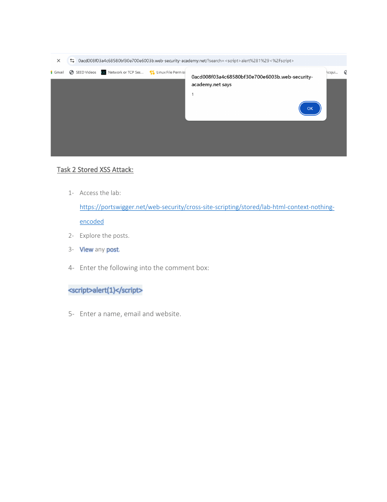

# Stored XSS Through Blog Comments


## Overview

An authorized PortSwigger exercise showing how a persistent payload can be saved in a blog comment and executed when the affected page is viewed.

## Objective

Validate stored XSS by submitting a harmless JavaScript payload through a comment form and confirming that it executes after the content is stored.

## Ethical Scope

This repository documents an exercise completed in an authorized training environment. It must not be used against systems, accounts, or people without explicit permission. All credentials, targets, and payloads referenced here are limited to disposable lab resources.

## Skills Demonstrated

- Stored XSS testing
- Persistent input analysis
- Comment-form assessment
- Browser execution validation

## Tools Used

- PortSwigger Web Security Academy
- Burp Suite
- Kali Linux
- Web browser

## Lab Environment

PortSwigger training lab: Stored XSS into an HTML context with nothing encoded.

## Step-by-Step Walkthrough

1. Open the assigned stored-XSS lab.
2. Browse to a blog post and locate the comment form.
3. Place the provided alert payload in the comment field.
4. Complete the remaining form fields with non-sensitive test data.
5. Post the comment and return to the blog page.
6. Confirm that the stored payload executes when the content is rendered.

## Commands and Test Inputs

```text
<script>alert(1)</script>
```

## Security Concepts

- Stored XSS persists in server-side storage and can affect multiple page views.
- Server-side validation and context-aware output encoding are required even when data originates from an authenticated form.

## Defensive Recommendations

- Use secure coding controls appropriate to the demonstrated weakness.
- Apply least privilege and strong server-side authorization.
- Log and alert on suspicious input, authentication, and data-change patterns.
- Keep testing isolated and limited to explicitly authorized targets.

## MITRE ATT&CK Mapping

MITRE ATT&CK Enterprise: T1059.007 - JavaScript (conceptual mapping only).

## Lessons Learned

- Persistence changes the risk profile because the payload can execute for later visitors.
- Test accounts and non-sensitive data should always be used in training environments.

## Evidence




## Source Material

- `XSS ATTACK KAUST PORTSWIGGER.pdf`
- Relevant source pages: 2, 3

## Disclaimer

This project is provided for education, defensive learning, and portfolio documentation. It does not authorize testing of third-party systems.
