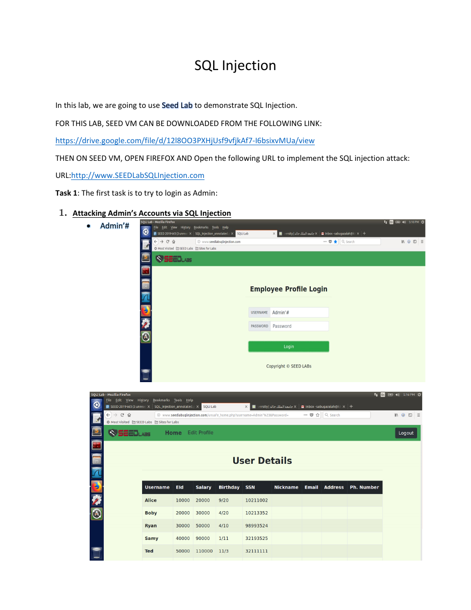

# SQL Injection Authentication Bypass


## Overview

A SEED Labs exercise demonstrating how unsafe query construction can allow an attacker to authenticate as the administrative user without knowing the password.

## Objective

Use the supplied username input in the local SEED training application to alter the login query and access the administrator account.

## Ethical Scope

This repository documents an exercise completed in an authorized training environment. It must not be used against systems, accounts, or people without explicit permission. All credentials, targets, and payloads referenced here are limited to disposable lab resources.

## Skills Demonstrated

- Authentication-bypass testing
- SQL comment syntax
- Input manipulation
- Vulnerable-query analysis

## Tools Used

- SEED VM
- Firefox
- SEED SQL Injection Lab

## Lab Environment

Local SEED virtual machine and the training site http://www.SEEDLabSQLInjection.com.

## Step-by-Step Walkthrough

1. Start the SEED virtual machine.
2. Open Firefox in the VM and browse to the SQL Injection training site.
3. Use the administrator username input supplied in the lab material.
4. Submit the form and verify that authentication is bypassed in the lab.
5. Document why the resulting SQL condition succeeds.

## Commands and Test Inputs

```text
Admin'#
```

## Security Concepts

- SQL injection occurs when untrusted input is concatenated into a database query.
- Parameterized queries prevent user data from changing query structure.

## Defensive Recommendations

- Use secure coding controls appropriate to the demonstrated weakness.
- Apply least privilege and strong server-side authorization.
- Log and alert on suspicious input, authentication, and data-change patterns.
- Keep testing isolated and limited to explicitly authorized targets.

## MITRE ATT&CK Mapping

MITRE ATT&CK Enterprise: T1190 - Exploit Public-Facing Application (conceptual mapping in a local training environment).

## Lessons Learned

- A comment token can remove the password condition when the application builds SQL unsafely.
- Authentication logic must never rely on string concatenation.

## Evidence



## Source Material

- `SQL Injection KAUST SEED VM.pdf`
- Relevant source pages: 1

## Disclaimer

This project is provided for education, defensive learning, and portfolio documentation. It does not authorize testing of third-party systems.
