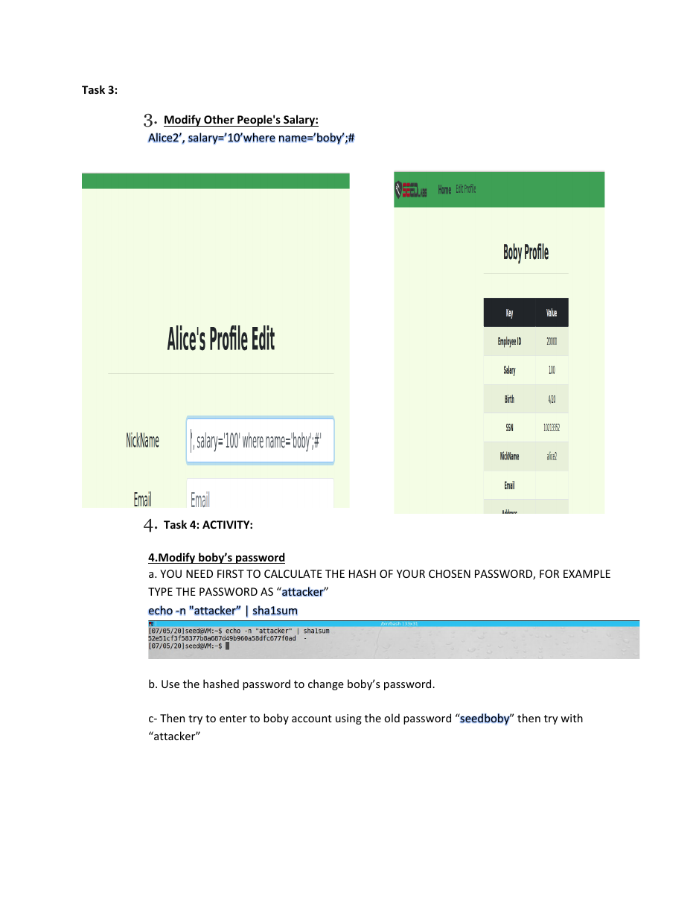

# Modifying Another User’s Salary Through SQL Injection


## Overview

A SEED Labs exercise demonstrating horizontal privilege abuse by injecting an additional condition that targets another user’s salary record.

## Objective

Use the vulnerable update flow to modify Boby’s salary while operating from Alice’s context, then verify the integrity impact.

## Ethical Scope

This repository documents an exercise completed in an authorized training environment. It must not be used against systems, accounts, or people without explicit permission. All credentials, targets, and payloads referenced here are limited to disposable lab resources.

## Skills Demonstrated

- Horizontal authorization testing
- WHERE-clause manipulation
- SQL comments
- Data-integrity validation

## Tools Used

- SEED VM
- Firefox
- SEED SQL Injection Lab

## Lab Environment

Local SEED SQL Injection training application with Alice and Boby test accounts.

## Step-by-Step Walkthrough

1. Access the vulnerable profile update page as Alice.
2. Insert the lab-provided value that closes the current assignment and targets Boby’s record.
3. Submit the update in the isolated environment.
4. Verify the changed value through the application or the relevant profile view.
5. Explain why missing authorization and unsafe SQL construction make the attack possible.

## Commands and Test Inputs

```text
Alice2', salary='10' where name='boby';#
```

## Security Concepts

- Horizontal privilege escalation occurs when one user can change another user’s data.
- Authorization must be enforced independently of client-supplied identifiers.

## Defensive Recommendations

- Use secure coding controls appropriate to the demonstrated weakness.
- Apply least privilege and strong server-side authorization.
- Log and alert on suspicious input, authentication, and data-change patterns.
- Keep testing isolated and limited to explicitly authorized targets.

## MITRE ATT&CK Mapping

MITRE ATT&CK Enterprise: T1565.001 - Stored Data Manipulation (conceptual mapping).

## Lessons Learned

- SQL injection and broken access control can combine to increase impact.
- Audit logging should capture sensitive cross-account changes.

## Evidence



## Source Material

- `SQL Injection KAUST SEED VM.pdf`
- Relevant source pages: 3

## Disclaimer

This project is provided for education, defensive learning, and portfolio documentation. It does not authorize testing of third-party systems.
