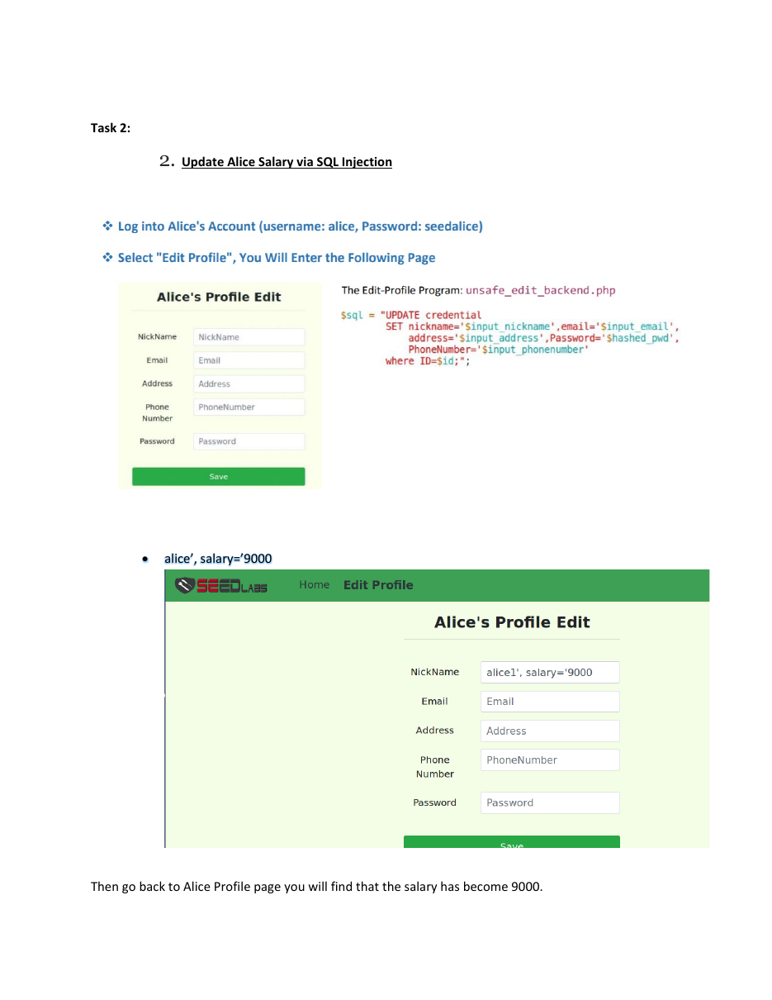

# Updating Alice’s Salary Through SQL Injection


## Overview

A SEED Labs exercise showing how an injectable profile update can be manipulated to change a protected salary field.

## Objective

Modify Alice’s salary to the value specified by the lab and verify the change in the profile page.

## Ethical Scope

This repository documents an exercise completed in an authorized training environment. It must not be used against systems, accounts, or people without explicit permission. All credentials, targets, and payloads referenced here are limited to disposable lab resources.

## Skills Demonstrated

- UPDATE-query manipulation
- Profile-form testing
- Data-integrity impact analysis
- Result verification

## Tools Used

- SEED VM
- Firefox
- SEED SQL Injection Lab

## Lab Environment

Local SEED SQL Injection training application.

## Step-by-Step Walkthrough

1. Log in to the Alice test account in the SEED lab.
2. Locate the vulnerable profile update function.
3. Use the supplied injected value to alter the salary assignment.
4. Submit the request.
5. Return to Alice’s profile and verify that the salary is now 9000.

## Commands and Test Inputs

```text
alice', salary='9000
```

## Security Concepts

- SQL injection can affect data integrity, not only confidentiality.
- Applications should enforce server-side authorization for every field that can be changed.

## Defensive Recommendations

- Use secure coding controls appropriate to the demonstrated weakness.
- Apply least privilege and strong server-side authorization.
- Log and alert on suspicious input, authentication, and data-change patterns.
- Keep testing isolated and limited to explicitly authorized targets.

## MITRE ATT&CK Mapping

MITRE ATT&CK Enterprise: T1565.001 - Stored Data Manipulation (conceptual mapping).

## Lessons Learned

- Input validation alone is not a substitute for parameterized queries.
- Sensitive fields should be excluded from user-controlled update statements.

## Evidence



## Source Material

- `SQL Injection KAUST SEED VM.pdf`
- Relevant source pages: 2

## Disclaimer

This project is provided for education, defensive learning, and portfolio documentation. It does not authorize testing of third-party systems.
