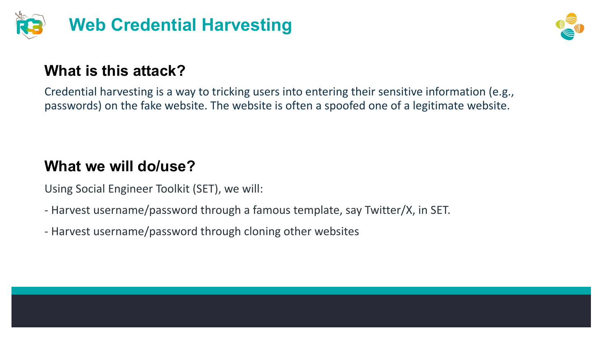
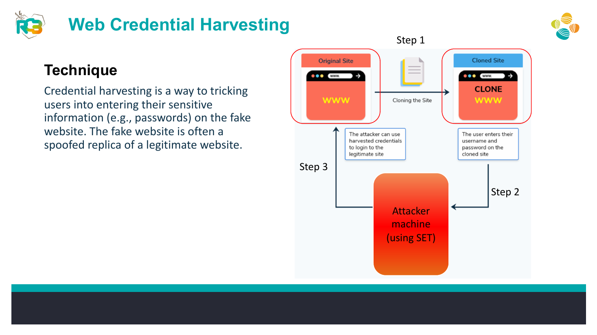
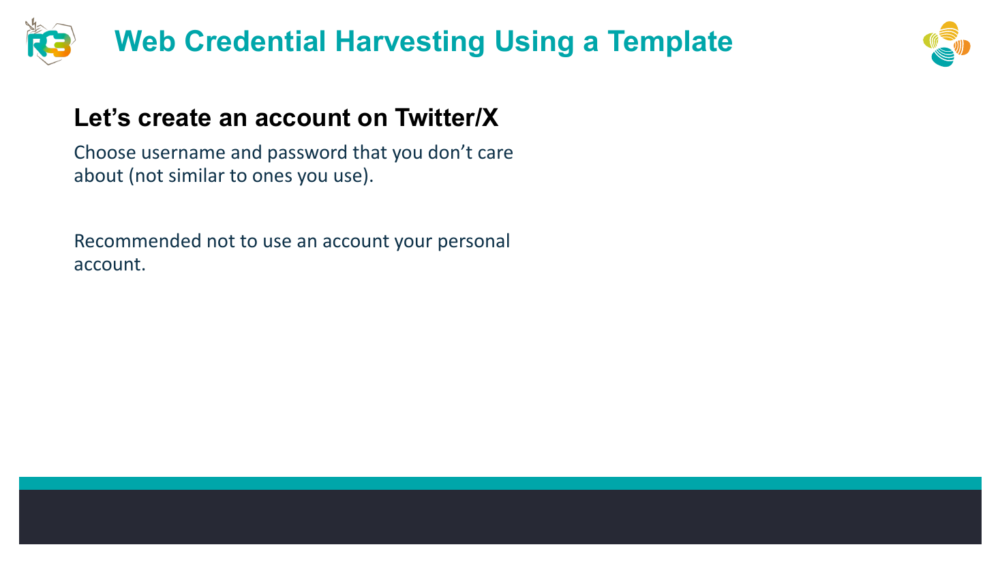
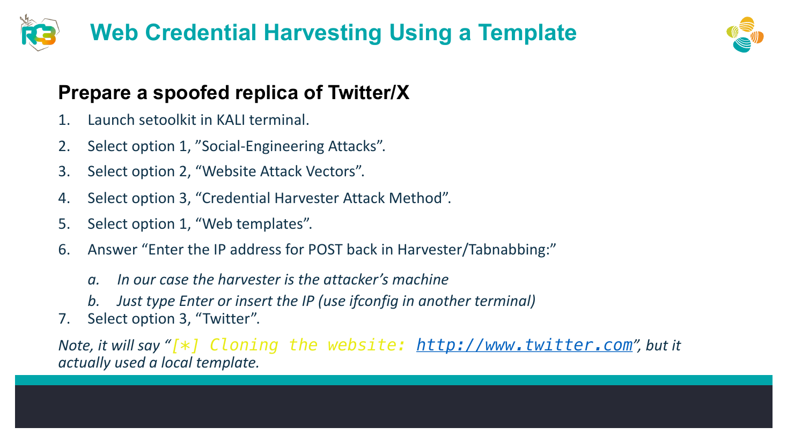
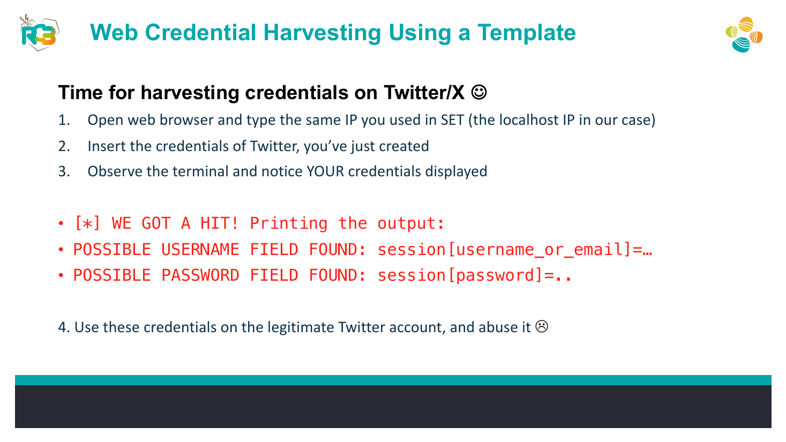

# SET Credential Harvester Using a Local Template


## Overview

A controlled awareness lab using SET’s local social-media template to demonstrate how a spoofed login page can capture dummy credentials.

## Objective

Build the local template, submit non-sensitive test credentials, observe how the fields appear in SET, and document detection and prevention measures.

## Ethical Scope

This repository documents an exercise completed in an authorized training environment. It must not be used against systems, accounts, or people without explicit permission. All credentials, targets, and payloads referenced here are limited to disposable lab resources.

> **Source limitation:** The source material suggests trying captured credentials on a legitimate account; this portfolio version intentionally excludes that action and uses dummy data only.

## Skills Demonstrated

- Credential-phishing simulation
- SET website attack vectors
- Local web hosting
- Form-submission analysis
- Awareness controls

## Tools Used

- Social-Engineer Toolkit (SET)
- Kali Linux
- Firefox
- Dummy test account

## Lab Environment

Localhost or an isolated lab IP with a throwaway account and credentials that are not reused anywhere.

## Step-by-Step Walkthrough

1. Create a disposable social-media test account using unique credentials.
2. Launch SET and select Website Attack Vectors.
3. Select Credential Harvester Attack Method and Web Templates.
4. Set the POST-back address to the isolated attacker VM.
5. Choose the Twitter/X local template described in the material.
6. Browse to the local lab IP and submit only the dummy credentials.
7. Observe the captured form fields in the SET terminal.
8. Destroy the dummy credentials after the exercise and document mitigations.

## Commands and Test Inputs

```text
SET menu path: Social-Engineering Attacks -> Website Attack Vectors -> Credential Harvester Attack Method -> Web Templates -> Twitter
```

## Security Concepts

- Credential harvesting relies on visual trust and user submission rather than a technical exploit.
- Password managers, MFA, domain verification, and security awareness reduce risk.

## Defensive Recommendations

- Use secure coding controls appropriate to the demonstrated weakness.
- Apply least privilege and strong server-side authorization.
- Log and alert on suspicious input, authentication, and data-change patterns.
- Keep testing isolated and limited to explicitly authorized targets.

## MITRE ATT&CK Mapping

MITRE ATT&CK Enterprise: T1566.002 - Spearphishing Link and T1056.003 - Web Portal Capture (conceptual mapping).

## Lessons Learned

- Never use real or reused passwords during phishing simulations.
- The exercise is most valuable when paired with detection indicators and user-reporting guidance.

## Evidence







## Source Material

- `Day_4_AL_Social_Engineering.pdf`
- Relevant source pages: 17, 18, 19, 20, 21

## Disclaimer

This project is provided for education, defensive learning, and portfolio documentation. It does not authorize testing of third-party systems.
