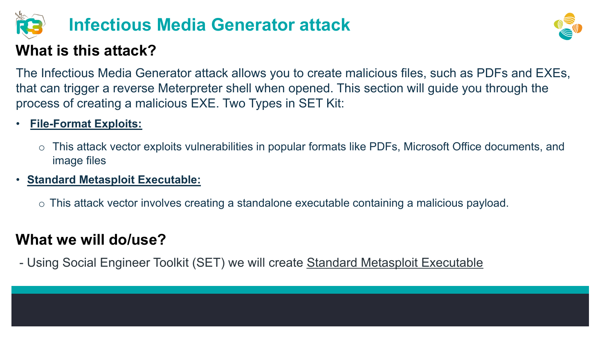
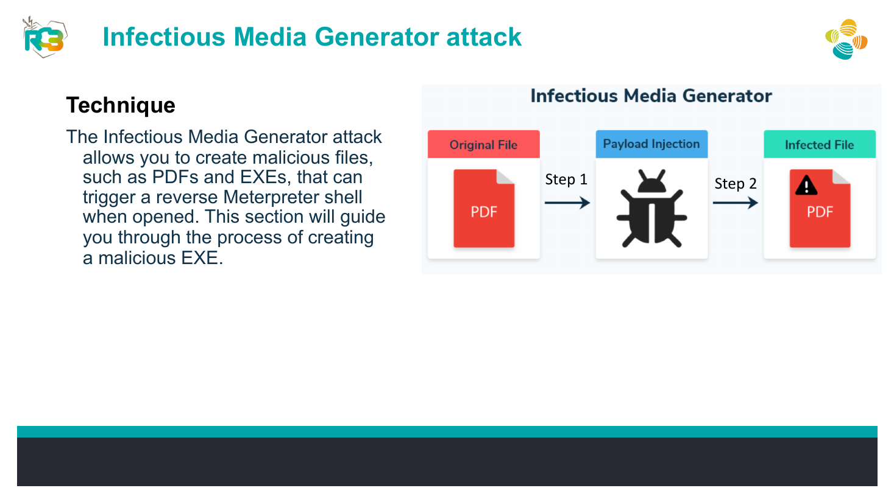
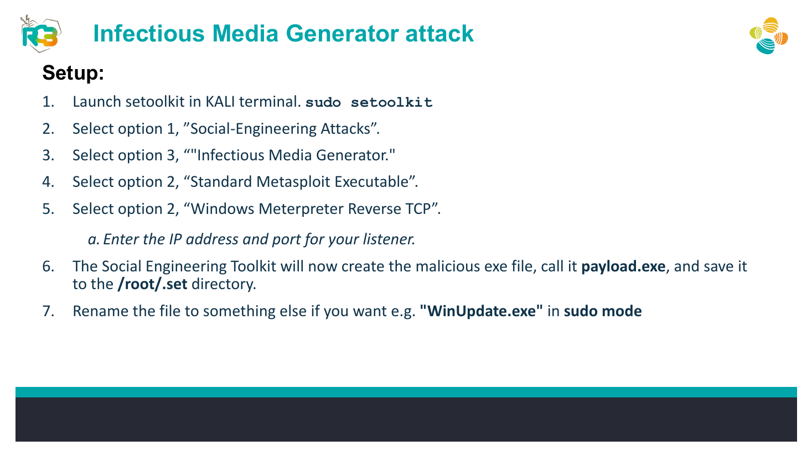
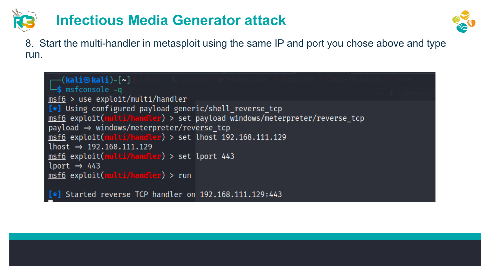
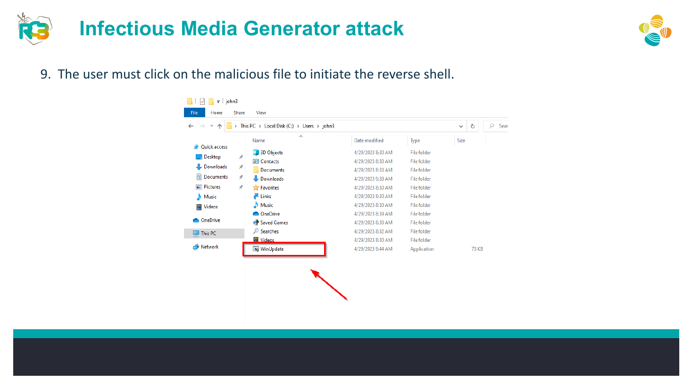
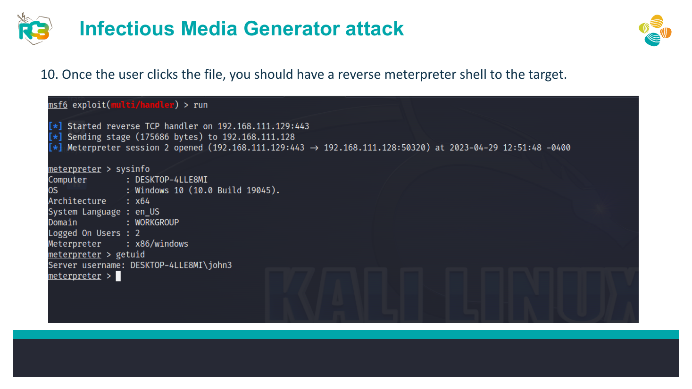

# SET Infectious Media Reverse-Shell Simulation


## Overview

A controlled SET exercise demonstrating how a generated executable can initiate a reverse Meterpreter session when launched in an isolated victim VM.

## Objective

Understand the payload generation, listener configuration, user-execution dependency, and defensive telemetry associated with an infectious-media scenario.

## Ethical Scope

This repository documents an exercise completed in an authorized training environment. It must not be used against systems, accounts, or people without explicit permission. All credentials, targets, and payloads referenced here are limited to disposable lab resources.

> **Source limitation:** Use only inside an isolated, authorized lab. Do not distribute generated executables.

## Skills Demonstrated

- SET payload generation
- Reverse-connection concepts
- Metasploit handler configuration
- Endpoint telemetry analysis
- Safe lab containment

## Tools Used

- Social-Engineer Toolkit (SET)
- Metasploit
- Kali Linux
- Disposable Windows VM

## Lab Environment

Two isolated virtual machines on a non-routed lab network. Use snapshots and no production credentials or data.

## Step-by-Step Walkthrough

1. Launch SET with elevated privileges.
2. Navigate to Social-Engineering Attacks and Infectious Media Generator.
3. Choose Standard Metasploit Executable and the Windows Meterpreter Reverse TCP training payload.
4. Enter the listener IP and port assigned to the isolated attacker VM.
5. Allow SET to generate the lab executable in its output directory.
6. Start a matching Metasploit multi-handler.
7. Execute the file only inside the disposable victim VM.
8. Confirm the lab session, capture logs, then revert the VM snapshot.

## Commands and Test Inputs

```text
sudo setoolkit
```

```text
SET menu path: Social-Engineering Attacks -> Infectious Media Generator -> Standard Metasploit Executable
```

```text
Metasploit multi-handler configured with the same isolated LHOST/LPORT
```

## Security Concepts

- Reverse shells require outbound connectivity from the executed payload to the listener.
- EDR, application control, email filtering, and user-execution prevention can interrupt this chain.

## Defensive Recommendations

- Use secure coding controls appropriate to the demonstrated weakness.
- Apply least privilege and strong server-side authorization.
- Log and alert on suspicious input, authentication, and data-change patterns.
- Keep testing isolated and limited to explicitly authorized targets.

## MITRE ATT&CK Mapping

MITRE ATT&CK Enterprise: T1204.002 - Malicious File, T1059 - Command and Scripting Interpreter, and T1105 - Ingress Tool Transfer (conceptual lab mapping).

## Lessons Learned

- Listener and payload network settings must match.
- Disposable snapshots and segmentation are essential when working with executable payloads.

## Evidence








## Source Material

- `Day_4_AL_Social_Engineering.pdf`
- Relevant source pages: 11, 12, 13, 14, 15, 16

## Disclaimer

This project is provided for education, defensive learning, and portfolio documentation. It does not authorize testing of third-party systems.
