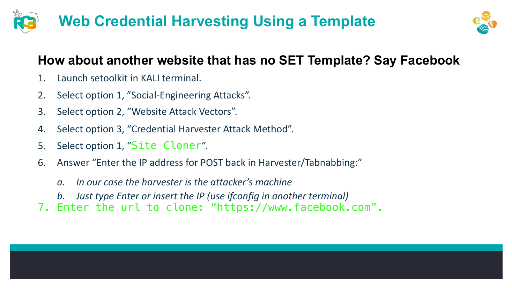

# SET Site Cloner Credential-Harvesting Simulation


## Overview

A controlled SET exercise showing how the Site Cloner option can reproduce the appearance of a login page for phishing-awareness and defensive testing.

## Objective

Clone the page specified by the course inside an isolated lab, route form submissions to the local harvester, and document controls that help users identify cloned sites.

## Ethical Scope

This repository documents an exercise completed in an authorized training environment. It must not be used against systems, accounts, or people without explicit permission. All credentials, targets, and payloads referenced here are limited to disposable lab resources.

> **Source limitation:** This portfolio write-up limits the exercise to isolated dummy data.

## Skills Demonstrated

- Site-cloning concepts
- Credential-harvester configuration
- POST-back analysis
- Phishing indicator documentation

## Tools Used

- Social-Engineer Toolkit (SET)
- Kali Linux
- Firefox
- Isolated lab network

## Lab Environment

Isolated environment with dummy inputs only. Do not host the cloned page publicly or collect real credentials.

## Step-by-Step Walkthrough

1. Launch SET and select Social-Engineering Attacks.
2. Open Website Attack Vectors and Credential Harvester Attack Method.
3. Choose Site Cloner.
4. Set the POST-back IP to the isolated attacker machine.
5. Enter the page URL specified in the lab material.
6. Open the cloned page only from the isolated test browser.
7. Submit dummy values and observe the local terminal output.
8. Document visible URL, certificate, MFA, and password-manager indicators that distinguish legitimate and cloned pages.

## Commands and Test Inputs

```text
SET menu path: Social-Engineering Attacks -> Website Attack Vectors -> Credential Harvester Attack Method -> Site Cloner
```

```text
Course example URL: https://www.facebook.com
```

## Security Concepts

- Cloned pages imitate appearance but cannot legitimately reproduce trusted domain ownership and certificate context.
- Password managers and phishing-resistant MFA reduce the usefulness of captured passwords.

## Defensive Recommendations

- Use secure coding controls appropriate to the demonstrated weakness.
- Apply least privilege and strong server-side authorization.
- Log and alert on suspicious input, authentication, and data-change patterns.
- Keep testing isolated and limited to explicitly authorized targets.

## MITRE ATT&CK Mapping

MITRE ATT&CK Enterprise: T1566.002 - Spearphishing Link and T1056.003 - Web Portal Capture (conceptual mapping).

## Lessons Learned

- Browser address-bar verification is a critical defensive habit.
- Public hosting or real credential collection is outside the authorized scope of this lab.

## Evidence



## Source Material

- `Day_4_AL_Social_Engineering.pdf`
- Relevant source pages: 22

## Disclaimer

This project is provided for education, defensive learning, and portfolio documentation. It does not authorize testing of third-party systems.
