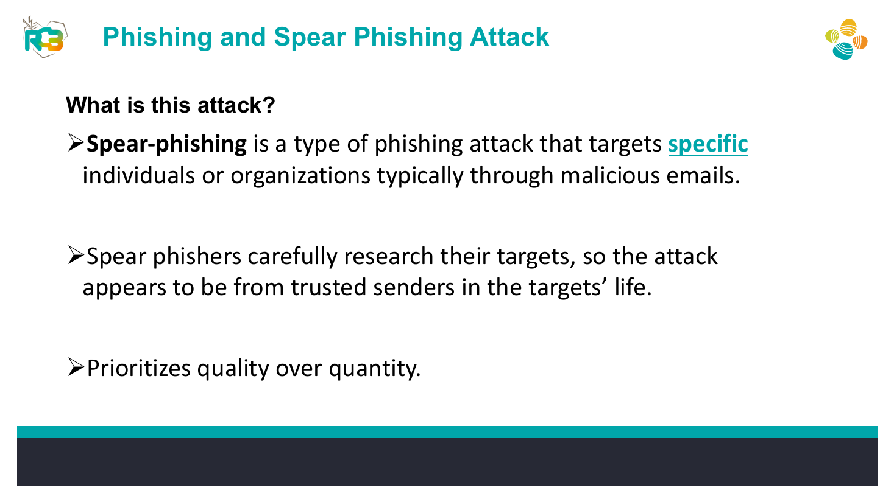
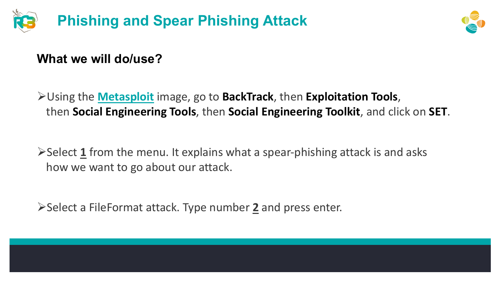
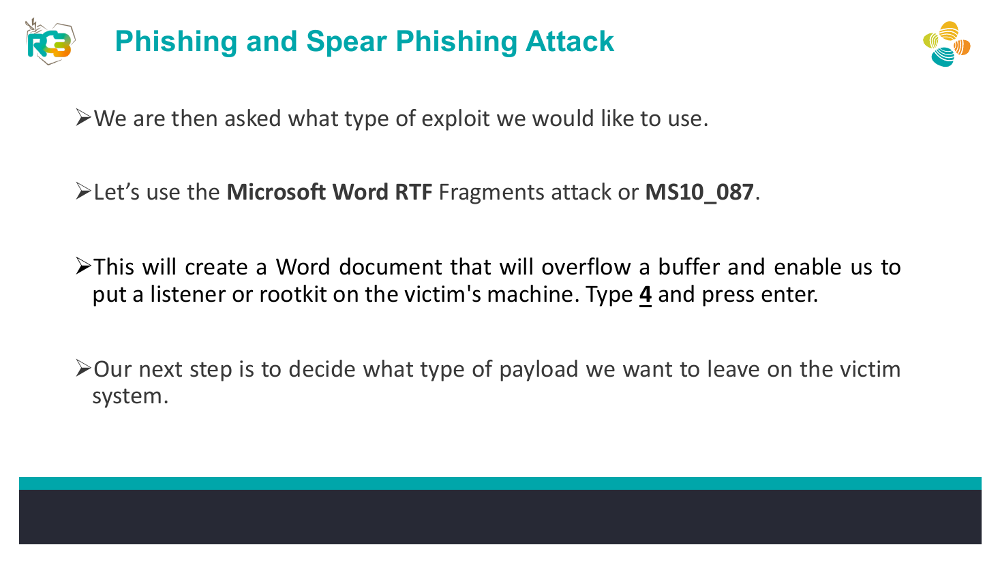
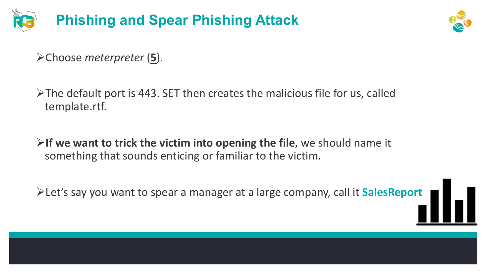
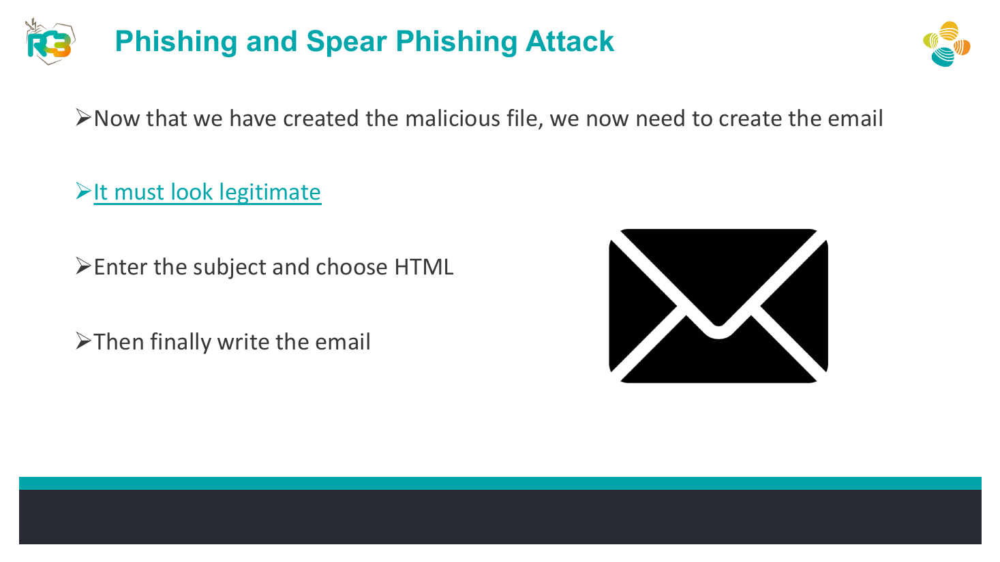
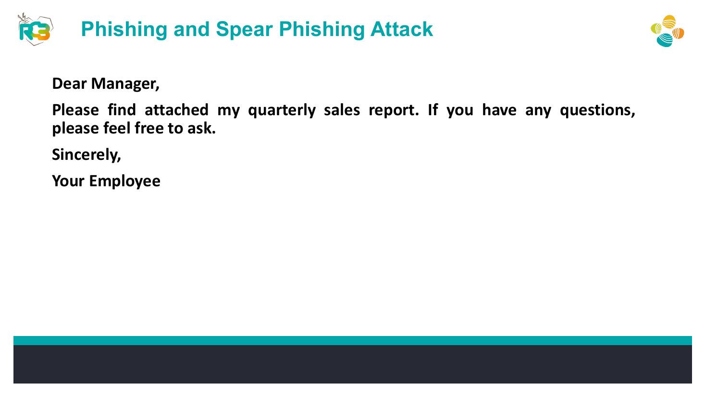
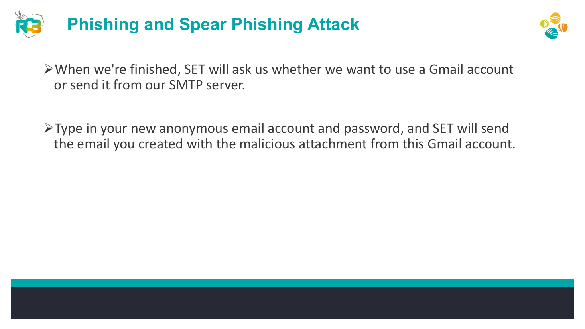

# SET Spear-Phishing File-Format Simulation


## Overview

A controlled social-engineering simulation using the Social-Engineer Toolkit to understand how a malicious document and a convincing email pretext can be combined in a spear-phishing campaign.

## Objective

Build the training artifact and email scenario inside an isolated lab so defenders can understand the attack chain, detection points, and user-awareness controls.

## Ethical Scope

This repository documents an exercise completed in an authorized training environment. It must not be used against systems, accounts, or people without explicit permission. All credentials, targets, and payloads referenced here are limited to disposable lab resources.

> **Source limitation:** This README is intentionally scoped to an isolated simulation with dummy accounts and no real-world delivery.

## Skills Demonstrated

- Spear-phishing attack-chain analysis
- Pretext evaluation
- SET navigation
- Payload/listener coordination
- Defensive documentation

## Tools Used

- Social-Engineer Toolkit (SET)
- Metasploit training image
- Isolated lab network

## Lab Environment

Isolated virtual machines with dummy accounts only. No real recipients, production email services, or external systems should be used.

## Step-by-Step Walkthrough

1. Launch SET in the lab image.
2. Select Social-Engineering Attacks and the spear-phishing/file-format workflow.
3. Choose the training file-format exploit specified in the material.
4. Select the Meterpreter training payload and retain the assigned listener settings.
5. Rename the generated document to match the fictional scenario.
6. Draft the fictional sales-report pretext shown in the training material.
7. Send only to a controlled lab mailbox and record defensive indicators.

## Commands and Test Inputs

```text
SET menu path: Social-Engineering Attacks -> Spear-Phishing Attack Vectors -> FileFormat Payload
```

```text
Training exploit referenced in source: Microsoft Word RTF Fragments / MS10-087
```

```text
Training payload referenced in source: Meterpreter
```

## Security Concepts

- Spear phishing combines technical delivery with target-specific social engineering.
- Defenses include attachment sandboxing, email authentication, endpoint controls, and user reporting procedures.

## Defensive Recommendations

- Use secure coding controls appropriate to the demonstrated weakness.
- Apply least privilege and strong server-side authorization.
- Log and alert on suspicious input, authentication, and data-change patterns.
- Keep testing isolated and limited to explicitly authorized targets.

## MITRE ATT&CK Mapping

MITRE ATT&CK Enterprise: T1566.001 - Spearphishing Attachment and T1204.002 - Malicious File (conceptual mapping in a controlled lab).

## Lessons Learned

- A believable pretext is a major part of phishing risk.
- Documenting observable indicators makes the exercise useful for blue-team detection and awareness.

## Evidence









## Source Material

- `Day_4_AL_Social_Engineering.pdf`
- Relevant source pages: 4, 5, 6, 7, 8, 9, 10

## Disclaimer

This project is provided for education, defensive learning, and portfolio documentation. It does not authorize testing of third-party systems.
