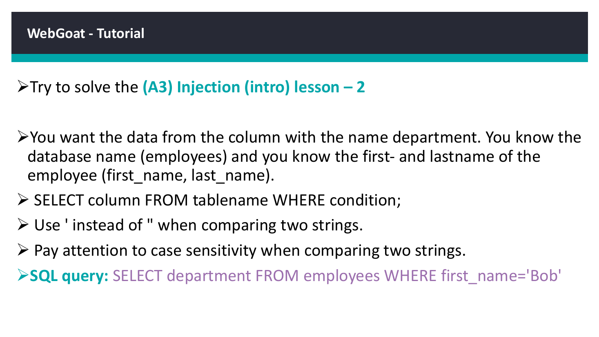

# WebGoat Injection Intro - Lesson 2: SELECT Query


## Overview

A focused WebGoat exercise from the A3 Injection (Intro) lesson set. The application is intentionally vulnerable and designed for safe, local security training.

## Objective

Retrieve the department value for employee Bob using a correctly structured SELECT statement.

## Ethical Scope

This repository documents an exercise completed in an authorized training environment. It must not be used against systems, accounts, or people without explicit permission. All credentials, targets, and payloads referenced here are limited to disposable lab resources.

## Skills Demonstrated

- SELECT syntax
- Column and table selection
- WHERE-clause filtering
- WebGoat lab validation

## Tools Used

- WebGoat
- Java
- Firefox
- Local training environment

## Lab Environment

Local WebGoat instance launched from the provided JAR on ports 8080 and 9090.

## Step-by-Step Walkthrough

1. Launch WebGoat with the command shown in the training material.
2. Create a local training user and sign in.
3. Open the specified A3 Injection (Intro) lesson.
4. Enter the supplied SQL statement or injection string.
5. Submit the exercise and confirm completion.
6. Document the query behavior and the secure alternative.

## Commands and Test Inputs

```text
java -Dfile.encoding=UTF-8 -Dwebgoat.port=8080 -Dwebwolf.port=9090 -jar webgoat-2023.8.jar
```

```text
SELECT department FROM employees WHERE first_name='Bob'
```

## Security Concepts

- The lesson demonstrates how SQL statements behave and how unsafe input handling can alter query intent.
- Prepared statements and least-privilege database accounts reduce injection impact.

## Defensive Recommendations

- Use secure coding controls appropriate to the demonstrated weakness.
- Apply least privilege and strong server-side authorization.
- Log and alert on suspicious input, authentication, and data-change patterns.
- Keep testing isolated and limited to explicitly authorized targets.

## MITRE ATT&CK Mapping

MITRE ATT&CK mapping is conceptual only; this is a local educational application. T1190 may describe exploitation of an exposed application, while data-manipulation lessons align conceptually with T1565.001.

## Lessons Learned

- The exact SQL context determines whether quotes, comments, or statement separators are needed.
- Destructive statements belong only in disposable training databases.

## Evidence



## Source Material

- `Day_4_ML_Web Security.pdf`
- Relevant source pages: 21

## Disclaimer

This project is provided for education, defensive learning, and portfolio documentation. It does not authorize testing of third-party systems.
